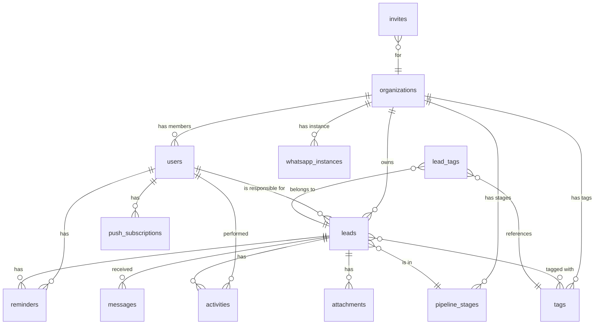

# DATABASE-SCHEMA — LeadZap

## Diagrama de Entidades



---

## Tabelas

### `organizations`

Tenant principal. Cada empresa que usa o sistema é uma organização.

| Coluna | Tipo | Nullable | Default | Descrição |
|--------|------|----------|---------|-----------|
| `id` | `uuid` | NOT NULL | `gen_random_uuid()` | PK |
| `name` | `text` | NOT NULL | — | Nome da empresa |
| `slug` | `text` | NOT NULL | — | Identificador único URL-safe (gerado a partir do nome) |
| `plan` | `text` | NOT NULL | `'starter'` | Plano atual: `starter`, `pro`, `business` |
| `max_users` | `integer` | NOT NULL | `1` | Limite de usuários do plano |
| `onboarding_completed` | `boolean` | NOT NULL | `false` | Se o wizard de onboarding foi concluído |
| `created_at` | `timestamptz` | NOT NULL | `now()` | Data de criação |
| `updated_at` | `timestamptz` | NOT NULL | `now()` | Última atualização |

**Índices:**
- `organizations_slug_key` UNIQUE em `slug` — para evitar duplicatas e permitir busca por slug.

---

### `users`

Usuários do sistema. Vinculados a uma organização e ao Supabase Auth.

| Coluna | Tipo | Nullable | Default | Descrição |
|--------|------|----------|---------|-----------|
| `id` | `uuid` | NOT NULL | — | PK. Mesmo ID do `auth.users` do Supabase. |
| `organization_id` | `uuid` | NULL | — | FK → organizations. NULL durante cadastro, antes de criar/entrar em org. |
| `email` | `text` | NOT NULL | — | Email do usuário (mesmo do auth) |
| `full_name` | `text` | NOT NULL | — | Nome completo |
| `role` | `text` | NOT NULL | `'user'` | Papel: `admin` ou `user` |
| `avatar_url` | `text` | NULL | — | URL do avatar (futuro) |
| `onboarding_completed` | `boolean` | NOT NULL | `false` | Se o usuário completou o onboarding |
| `created_at` | `timestamptz` | NOT NULL | `now()` | Data de criação |
| `updated_at` | `timestamptz` | NOT NULL | `now()` | Última atualização |

**Índices:**
- `users_email_key` UNIQUE em `email`.
- `users_organization_id_idx` em `organization_id` — busca frequente de membros por org.

**FK:** `organization_id` → `organizations(id)` ON DELETE SET NULL.

---

### `pipeline_stages`

Colunas do pipeline de vendas. Cada organização tem seu próprio conjunto.

| Coluna | Tipo | Nullable | Default | Descrição |
|--------|------|----------|---------|-----------|
| `id` | `uuid` | NOT NULL | `gen_random_uuid()` | PK |
| `organization_id` | `uuid` | NOT NULL | — | FK → organizations |
| `name` | `text` | NOT NULL | — | Nome da coluna (ex: "Novo Lead") |
| `position` | `integer` | NOT NULL | — | Ordem da coluna (0, 1, 2...) |
| `is_default` | `boolean` | NOT NULL | `false` | Se é uma das 5 colunas padrão (não deletável) |
| `is_won` | `boolean` | NOT NULL | `false` | Se representa negócio fechado (para contagem de receita) |
| `is_lost` | `boolean` | NOT NULL | `false` | Se representa negócio perdido |
| `created_at` | `timestamptz` | NOT NULL | `now()` | Data de criação |

**Índices:**
- `pipeline_stages_org_position_idx` UNIQUE em `(organization_id, position)` — garante ordem única.

**FK:** `organization_id` → `organizations(id)` ON DELETE CASCADE.

---

### `leads`

Entidade central. Cada lead é um potencial cliente.

| Coluna | Tipo | Nullable | Default | Descrição |
|--------|------|----------|---------|-----------|
| `id` | `uuid` | NOT NULL | `gen_random_uuid()` | PK |
| `organization_id` | `uuid` | NOT NULL | — | FK → organizations |
| `assigned_to` | `uuid` | NULL | — | FK → users. Responsável pelo lead. NULL = não atribuído. |
| `pipeline_stage_id` | `uuid` | NOT NULL | — | FK → pipeline_stages. Estágio atual no pipeline. |
| `name` | `text` | NOT NULL | — | Nome do lead/contato |
| `phone` | `text` | NOT NULL | — | Telefone principal (formato: +5511999999999) |
| `email` | `text` | NULL | — | Email (opcional) |
| `company` | `text` | NULL | — | Empresa do lead (opcional) |
| `source` | `text` | NOT NULL | `'manual'` | Origem: `manual`, `whatsapp`, `instagram`, `website`, `referral`, `other` |
| `estimated_value` | `numeric(12,2)` | NULL | — | Valor estimado do negócio em R$ |
| `notes` | `text` | NULL | — | Notas livres |
| `position` | `integer` | NOT NULL | `0` | Posição dentro da coluna (para ordenação) |
| `last_interaction_at` | `timestamptz` | NULL | — | Data da última interação (mensagem, nota, movimentação) |
| `deleted_at` | `timestamptz` | NULL | — | Soft delete. Se preenchido, lead não aparece nas queries. |
| `created_at` | `timestamptz` | NOT NULL | `now()` | Data de criação |
| `updated_at` | `timestamptz` | NOT NULL | `now()` | Última atualização |

**Índices:**
- `leads_org_phone_idx` UNIQUE em `(organization_id, phone)` WHERE `deleted_at IS NULL` — impede duplicata de telefone na mesma org (somente leads ativos).
- `leads_org_stage_idx` em `(organization_id, pipeline_stage_id)` — busca de leads por coluna.
- `leads_assigned_to_idx` em `assigned_to` — filtro por responsável.
- `leads_org_deleted_idx` em `(organization_id, deleted_at)` — query principal de leads ativos.

**FKs:**
- `organization_id` → `organizations(id)` ON DELETE CASCADE.
- `assigned_to` → `users(id)` ON DELETE SET NULL.
- `pipeline_stage_id` → `pipeline_stages(id)` ON DELETE RESTRICT.

---

### `tags`

Tags disponíveis por organização.

| Coluna | Tipo | Nullable | Default | Descrição |
|--------|------|----------|---------|-----------|
| `id` | `uuid` | NOT NULL | `gen_random_uuid()` | PK |
| `organization_id` | `uuid` | NOT NULL | — | FK → organizations |
| `name` | `text` | NOT NULL | — | Nome da tag (ex: "quente") |
| `color` | `text` | NOT NULL | `'#6B7280'` | Cor hex para exibição visual |
| `created_at` | `timestamptz` | NOT NULL | `now()` | Data de criação |

**Índices:**
- `tags_org_name_idx` UNIQUE em `(organization_id, name)` — sem tags duplicadas por org.

**FK:** `organization_id` → `organizations(id)` ON DELETE CASCADE.

---

### `lead_tags`

Tabela de junção N:N entre leads e tags.

| Coluna | Tipo | Nullable | Default | Descrição |
|--------|------|----------|---------|-----------|
| `lead_id` | `uuid` | NOT NULL | — | FK → leads |
| `tag_id` | `uuid` | NOT NULL | — | FK → tags |
| `created_at` | `timestamptz` | NOT NULL | `now()` | Quando a tag foi atribuída |

**PK:** `(lead_id, tag_id)` — composta.

**FKs:**
- `lead_id` → `leads(id)` ON DELETE CASCADE.
- `tag_id` → `tags(id)` ON DELETE CASCADE.

---

### `messages`

Mensagens do WhatsApp recebidas via Evolution API.

| Coluna | Tipo | Nullable | Default | Descrição |
|--------|------|----------|---------|-----------|
| `id` | `uuid` | NOT NULL | `gen_random_uuid()` | PK |
| `organization_id` | `uuid` | NOT NULL | — | FK → organizations |
| `lead_id` | `uuid` | NOT NULL | — | FK → leads. Lead vinculado. |
| `whatsapp_message_id` | `text` | NULL | — | ID da mensagem na Evolution API (para dedup) |
| `sender_phone` | `text` | NOT NULL | — | Telefone do remetente |
| `sender_name` | `text` | NULL | — | Nome do perfil do WhatsApp |
| `content` | `text` | NULL | — | Conteúdo da mensagem (texto). NULL se for mídia. |
| `media_type` | `text` | NULL | — | Tipo de mídia: `image`, `audio`, `video`, `document`, NULL se texto. |
| `is_from_lead` | `boolean` | NOT NULL | `true` | Se a mensagem foi enviada pelo lead (vs. pela empresa). No MVP (leitura), sempre true. |
| `received_at` | `timestamptz` | NOT NULL | — | Timestamp original da mensagem no WhatsApp. |
| `created_at` | `timestamptz` | NOT NULL | `now()` | Quando foi inserida no sistema. |

**Índices:**
- `messages_lead_id_idx` em `lead_id` — busca de mensagens por lead.
- `messages_whatsapp_id_idx` UNIQUE em `(organization_id, whatsapp_message_id)` WHERE `whatsapp_message_id IS NOT NULL` — dedup de webhooks.
- `messages_org_received_idx` em `(organization_id, received_at DESC)` — listagem cronológica.

**FKs:**
- `organization_id` → `organizations(id)` ON DELETE CASCADE.
- `lead_id` → `leads(id)` ON DELETE CASCADE.

---

### `reminders`

Lembretes manuais criados por usuários.

| Coluna | Tipo | Nullable | Default | Descrição |
|--------|------|----------|---------|-----------|
| `id` | `uuid` | NOT NULL | `gen_random_uuid()` | PK |
| `organization_id` | `uuid` | NOT NULL | — | FK → organizations |
| `user_id` | `uuid` | NOT NULL | — | FK → users. Quem criou e deve ser notificado. |
| `lead_id` | `uuid` | NOT NULL | — | FK → leads. Lead vinculado. |
| `title` | `text` | NOT NULL | — | Texto do lembrete (ex: "Enviar orçamento") |
| `due_at` | `timestamptz` | NOT NULL | — | Data e hora do vencimento. |
| `completed_at` | `timestamptz` | NULL | — | Quando foi concluído. NULL = pendente. |
| `push_sent` | `boolean` | NOT NULL | `false` | Se a push notification já foi enviada. |
| `created_at` | `timestamptz` | NOT NULL | `now()` | Data de criação. |

**Índices:**
- `reminders_user_due_idx` em `(user_id, due_at)` WHERE `completed_at IS NULL` — busca de lembretes pendentes do usuário.
- `reminders_push_pending_idx` em `(due_at)` WHERE `completed_at IS NULL AND push_sent = false` — query do cron de push notifications.

**FKs:**
- `organization_id` → `organizations(id)` ON DELETE CASCADE.
- `user_id` → `users(id)` ON DELETE CASCADE.
- `lead_id` → `leads(id)` ON DELETE CASCADE.

---

### `attachments`

Arquivos anexados a leads.

| Coluna | Tipo | Nullable | Default | Descrição |
|--------|------|----------|---------|-----------|
| `id` | `uuid` | NOT NULL | `gen_random_uuid()` | PK |
| `organization_id` | `uuid` | NOT NULL | — | FK → organizations |
| `lead_id` | `uuid` | NOT NULL | — | FK → leads |
| `uploaded_by` | `uuid` | NOT NULL | — | FK → users. Quem fez upload. |
| `file_name` | `text` | NOT NULL | — | Nome original do arquivo |
| `file_type` | `text` | NOT NULL | — | MIME type (image/jpeg, application/pdf, etc.) |
| `file_size` | `integer` | NOT NULL | — | Tamanho em bytes |
| `storage_path` | `text` | NOT NULL | — | Caminho no Supabase Storage (ex: `org_xxx/leads/lead_xxx/file.pdf`) |
| `created_at` | `timestamptz` | NOT NULL | `now()` | Data de upload |

**Índices:**
- `attachments_lead_id_idx` em `lead_id` — busca de anexos por lead.

**FKs:**
- `organization_id` → `organizations(id)` ON DELETE CASCADE.
- `lead_id` → `leads(id)` ON DELETE CASCADE.
- `uploaded_by` → `users(id)` ON DELETE SET NULL.

---

### `activities`

Log de atividades por lead (audit trail).

| Coluna | Tipo | Nullable | Default | Descrição |
|--------|------|----------|---------|-----------|
| `id` | `uuid` | NOT NULL | `gen_random_uuid()` | PK |
| `organization_id` | `uuid` | NOT NULL | — | FK → organizations |
| `lead_id` | `uuid` | NOT NULL | — | FK → leads |
| `user_id` | `uuid` | NULL | — | FK → users. NULL para ações do sistema (ex: lead criado via WhatsApp). |
| `type` | `text` | NOT NULL | — | Tipo da atividade (enum, ver abaixo) |
| `metadata` | `jsonb` | NULL | — | Dados adicionais (ex: `{"from_stage": "xxx", "to_stage": "yyy"}`) |
| `created_at` | `timestamptz` | NOT NULL | `now()` | Quando ocorreu |

**Índices:**
- `activities_lead_created_idx` em `(lead_id, created_at DESC)` — timeline do lead.

**FKs:**
- `organization_id` → `organizations(id)` ON DELETE CASCADE.
- `lead_id` → `leads(id)` ON DELETE CASCADE.
- `user_id` → `users(id)` ON DELETE SET NULL.

---

### `whatsapp_instances`

Conexão WhatsApp de cada organização via Evolution API.

| Coluna | Tipo | Nullable | Default | Descrição |
|--------|------|----------|---------|-----------|
| `id` | `uuid` | NOT NULL | `gen_random_uuid()` | PK |
| `organization_id` | `uuid` | NOT NULL | — | FK → organizations. UNIQUE — uma instância por org. |
| `instance_name` | `text` | NOT NULL | — | Nome da instância na Evolution API (ex: `org_xxx`) |
| `status` | `text` | NOT NULL | `'disconnected'` | Status: `connected`, `disconnected`, `connecting` |
| `phone_number` | `text` | NULL | — | Número do WhatsApp conectado |
| `last_connected_at` | `timestamptz` | NULL | — | Última vez que foi conectado |
| `created_at` | `timestamptz` | NOT NULL | `now()` | Data de criação |
| `updated_at` | `timestamptz` | NOT NULL | `now()` | Última atualização |

**Índices:**
- `whatsapp_instances_org_idx` UNIQUE em `organization_id` — uma instância por org.
- `whatsapp_instances_name_idx` UNIQUE em `instance_name` — nomes únicos na Evolution API.

**FK:** `organization_id` → `organizations(id)` ON DELETE CASCADE.

---

### `push_subscriptions`

Subscriptions para Web Push notifications.

| Coluna | Tipo | Nullable | Default | Descrição |
|--------|------|----------|---------|-----------|
| `id` | `uuid` | NOT NULL | `gen_random_uuid()` | PK |
| `user_id` | `uuid` | NOT NULL | — | FK → users |
| `endpoint` | `text` | NOT NULL | — | Push service endpoint URL |
| `p256dh` | `text` | NOT NULL | — | Chave pública do client |
| `auth` | `text` | NOT NULL | — | Auth secret do client |
| `created_at` | `timestamptz` | NOT NULL | `now()` | Data de registro |

**Índices:**
- `push_subscriptions_user_idx` em `user_id` — busca de subscriptions por user.
- `push_subscriptions_endpoint_idx` UNIQUE em `endpoint` — evita duplicatas.

**FK:** `user_id` → `users(id)` ON DELETE CASCADE.

---

### `invites`

Convites pendentes para entrar em uma organização.

| Coluna | Tipo | Nullable | Default | Descrição |
|--------|------|----------|---------|-----------|
| `id` | `uuid` | NOT NULL | `gen_random_uuid()` | PK |
| `organization_id` | `uuid` | NOT NULL | — | FK → organizations |
| `email` | `text` | NOT NULL | — | Email do convidado |
| `role` | `text` | NOT NULL | `'user'` | Papel que o convidado terá |
| `invited_by` | `uuid` | NOT NULL | — | FK → users. Quem convidou. |
| `token` | `text` | NOT NULL | `gen_random_uuid()` | Token único para o link de convite |
| `expires_at` | `timestamptz` | NOT NULL | `now() + interval '7 days'` | Expira em 7 dias |
| `accepted_at` | `timestamptz` | NULL | — | Quando foi aceito. NULL = pendente. |
| `created_at` | `timestamptz` | NOT NULL | `now()` | Data de criação |

**Índices:**
- `invites_token_idx` UNIQUE em `token` — busca por token no link.
- `invites_org_email_idx` UNIQUE em `(organization_id, email)` WHERE `accepted_at IS NULL` — um convite pendente por email por org.

**FKs:**
- `organization_id` → `organizations(id)` ON DELETE CASCADE.
- `invited_by` → `users(id)` ON DELETE CASCADE.

---

## Relacionamentos

| Relação | Tipo | Significado |
|---------|------|-------------|
| organization → users | 1:N | Uma organização tem múltiplos membros. |
| organization → leads | 1:N | Uma organização tem múltiplos leads. |
| organization → pipeline_stages | 1:N | Uma organização tem múltiplas colunas no pipeline. |
| organization → tags | 1:N | Cada org define suas próprias tags. |
| organization → whatsapp_instances | 1:1 | Uma instância WhatsApp por org. |
| user → leads (assigned_to) | 1:N | Um vendedor pode ter múltiplos leads atribuídos. |
| lead → pipeline_stages | N:1 | Cada lead está em exatamente um estágio. |
| lead ↔ tags (via lead_tags) | N:N | Um lead pode ter várias tags; uma tag pode estar em vários leads. |
| lead → messages | 1:N | Um lead tem múltiplas mensagens do WhatsApp. |
| lead → reminders | 1:N | Um lead pode ter múltiplos lembretes. |
| lead → attachments | 1:N | Um lead pode ter até 5 anexos. |
| lead → activities | 1:N | Um lead tem um log de atividades. |
| user → reminders | 1:N | Um usuário tem seus próprios lembretes. |
| user → push_subscriptions | 1:N | Um usuário pode ter subscriptions em múltiplos devices. |

---

## Row Level Security (RLS)

RLS é **obrigatório** em todas as tabelas. Sem exceção.

### `organizations`
- **SELECT:** Usuário pode ler apenas sua própria organização (`id = user.organization_id`).
- **UPDATE:** Apenas admin da org pode atualizar.
- **INSERT:** Via Server Action no onboarding (service role).
- **DELETE:** Não permitido via client.

### `users`
- **SELECT:** Usuário pode ler membros da sua própria organização.
- **UPDATE:** Usuário pode atualizar apenas seu próprio perfil. Admin pode atualizar role de membros da org.
- **INSERT:** Via trigger ou service role (cadastro/convite).
- **DELETE:** Não permitido via client.

### `leads`
- **SELECT:** Usuário com role `user` vê apenas leads com `assigned_to = auth.uid()` OR `assigned_to IS NULL`. Admin vê todos da org. Ambos filtram `deleted_at IS NULL`.
- **INSERT:** Qualquer membro da org pode criar lead (org_id must match).
- **UPDATE:** Responsável do lead ou admin pode atualizar.
- **DELETE:** Ninguém (soft delete via UPDATE de `deleted_at`, admin only).

### `pipeline_stages`
- **SELECT:** Todos da org podem ler.
- **INSERT/UPDATE/DELETE:** Apenas admin.

### `tags`
- **SELECT:** Todos da org podem ler.
- **INSERT:** Qualquer membro da org.
- **UPDATE/DELETE:** Admin only.

### `lead_tags`
- **SELECT:** Segue a regra de acesso do lead (join com leads).
- **INSERT/DELETE:** Quem tem acesso ao lead.

### `messages`
- **SELECT:** Segue a regra de acesso do lead.
- **INSERT:** Service role only (webhook).
- **UPDATE/DELETE:** Não permitido.

### `reminders`
- **SELECT:** Usuário vê apenas seus lembretes.
- **INSERT:** Qualquer membro da org (user_id must be self).
- **UPDATE:** Apenas dono do lembrete.
- **DELETE:** Dono ou admin.

### `attachments`
- **SELECT:** Segue a regra de acesso do lead.
- **INSERT:** Quem tem acesso ao lead. Validar limite de 5 por lead no Server Action.
- **DELETE:** Quem fez upload ou admin.

### `activities`
- **SELECT:** Segue a regra de acesso do lead.
- **INSERT:** Service role e Server Actions (não inserido diretamente pelo client).
- **UPDATE/DELETE:** Não permitido.

### `whatsapp_instances`
- **SELECT:** Admin da org.
- **INSERT/UPDATE:** Service role (gerenciado via Evolution API client).
- **DELETE:** Admin da org.

### `push_subscriptions`
- **SELECT:** Usuário vê apenas suas subscriptions.
- **INSERT:** Usuário insere apenas para si.
- **DELETE:** Usuário deleta apenas suas.

### `invites`
- **SELECT:** Admin vê convites da org. Qualquer um pode ler convite pelo token (via service role na rota /invite/[token]).
- **INSERT:** Admin only.
- **UPDATE:** Service role (ao aceitar convite).
- **DELETE:** Admin only.

---

## Enums (tipos com valores fixos)

Implementados como `text` com CHECK constraints (mais flexível que Postgres ENUM para alterações futuras):

```sql
-- Roles de usuário
ALTER TABLE users ADD CONSTRAINT users_role_check CHECK (role IN ('admin', 'user'));

-- Fontes de leads
ALTER TABLE leads ADD CONSTRAINT leads_source_check CHECK (source IN ('manual', 'whatsapp', 'instagram', 'website', 'referral', 'other'));

-- Tipos de mídia em mensagens
ALTER TABLE messages ADD CONSTRAINT messages_media_type_check CHECK (media_type IN ('image', 'audio', 'video', 'document') OR media_type IS NULL);

-- Status da instância WhatsApp
ALTER TABLE whatsapp_instances ADD CONSTRAINT whatsapp_status_check CHECK (status IN ('connected', 'disconnected', 'connecting'));

-- Tipos de atividade
ALTER TABLE activities ADD CONSTRAINT activities_type_check CHECK (type IN (
  'lead_created',
  'lead_updated',
  'lead_moved',
  'lead_assigned',
  'lead_deleted',
  'note_added',
  'tag_added',
  'tag_removed',
  'reminder_created',
  'reminder_completed',
  'attachment_added',
  'attachment_removed',
  'message_received'
));

-- Planos
ALTER TABLE organizations ADD CONSTRAINT organizations_plan_check CHECK (plan IN ('starter', 'pro', 'business'));
```

---

## Triggers e Funções

### 1. `update_updated_at` — Atualizar `updated_at` automaticamente

```sql
CREATE OR REPLACE FUNCTION update_updated_at()
RETURNS TRIGGER AS $$
BEGIN
  NEW.updated_at = now();
  RETURN NEW;
END;
$$ LANGUAGE plpgsql;

-- Aplicar em tabelas com updated_at
CREATE TRIGGER set_updated_at BEFORE UPDATE ON organizations FOR EACH ROW EXECUTE FUNCTION update_updated_at();
CREATE TRIGGER set_updated_at BEFORE UPDATE ON users FOR EACH ROW EXECUTE FUNCTION update_updated_at();
CREATE TRIGGER set_updated_at BEFORE UPDATE ON leads FOR EACH ROW EXECUTE FUNCTION update_updated_at();
CREATE TRIGGER set_updated_at BEFORE UPDATE ON whatsapp_instances FOR EACH ROW EXECUTE FUNCTION update_updated_at();
```

### 2. `create_user_profile` — Criar perfil ao registrar via Supabase Auth

```sql
CREATE OR REPLACE FUNCTION handle_new_user()
RETURNS TRIGGER AS $$
BEGIN
  INSERT INTO public.users (id, email, full_name)
  VALUES (
    NEW.id,
    NEW.email,
    COALESCE(NEW.raw_user_meta_data->>'full_name', NEW.email)
  );
  RETURN NEW;
END;
$$ LANGUAGE plpgsql SECURITY DEFINER;

CREATE TRIGGER on_auth_user_created
  AFTER INSERT ON auth.users
  FOR EACH ROW EXECUTE FUNCTION handle_new_user();
```

### 3. `create_default_pipeline` — Criar pipeline padrão ao criar organização

```sql
CREATE OR REPLACE FUNCTION create_default_pipeline()
RETURNS TRIGGER AS $$
BEGIN
  INSERT INTO pipeline_stages (organization_id, name, position, is_default, is_won, is_lost) VALUES
    (NEW.id, 'Novo Lead', 0, true, false, false),
    (NEW.id, 'Conversando', 1, true, false, false),
    (NEW.id, 'Proposta Enviada', 2, true, false, false),
    (NEW.id, 'Fechado', 3, true, true, false),
    (NEW.id, 'Perdido', 4, true, false, true);
  RETURN NEW;
END;
$$ LANGUAGE plpgsql SECURITY DEFINER;

CREATE TRIGGER on_organization_created
  AFTER INSERT ON organizations
  FOR EACH ROW EXECUTE FUNCTION create_default_pipeline();
```

### 4. `create_default_tags` — Criar tags padrão ao criar organização

```sql
CREATE OR REPLACE FUNCTION create_default_tags()
RETURNS TRIGGER AS $$
BEGIN
  INSERT INTO tags (organization_id, name, color) VALUES
    (NEW.id, 'Quente', '#EF4444'),
    (NEW.id, 'Frio', '#3B82F6'),
    (NEW.id, 'Indeciso', '#F59E0B'),
    (NEW.id, 'VIP', '#8B5CF6');
  RETURN NEW;
END;
$$ LANGUAGE plpgsql SECURITY DEFINER;

CREATE TRIGGER on_organization_created_tags
  AFTER INSERT ON organizations
  FOR EACH ROW EXECUTE FUNCTION create_default_tags();
```

---

## Dados de Seed

Não há dados de seed globais necessários. Dados iniciais são criados per-tenant via triggers:
- Pipeline stages padrão: criados automaticamente ao criar organização.
- Tags padrão: criadas automaticamente ao criar organização.

---

## SQL de Criação

```sql
-- ============================================
-- LeadZap — Database Schema
-- Execute no Supabase SQL Editor
-- ============================================

-- Habilitar extensões necessárias
CREATE EXTENSION IF NOT EXISTS "pgcrypto";

-- ============================================
-- TABELAS
-- ============================================

CREATE TABLE organizations (
  id uuid PRIMARY KEY DEFAULT gen_random_uuid(),
  name text NOT NULL,
  slug text NOT NULL UNIQUE,
  plan text NOT NULL DEFAULT 'starter',
  max_users integer NOT NULL DEFAULT 1,
  onboarding_completed boolean NOT NULL DEFAULT false,
  created_at timestamptz NOT NULL DEFAULT now(),
  updated_at timestamptz NOT NULL DEFAULT now(),
  CONSTRAINT organizations_plan_check CHECK (plan IN ('starter', 'pro', 'business'))
);

CREATE TABLE users (
  id uuid PRIMARY KEY,
  organization_id uuid REFERENCES organizations(id) ON DELETE SET NULL,
  email text NOT NULL UNIQUE,
  full_name text NOT NULL,
  role text NOT NULL DEFAULT 'user',
  avatar_url text,
  onboarding_completed boolean NOT NULL DEFAULT false,
  created_at timestamptz NOT NULL DEFAULT now(),
  updated_at timestamptz NOT NULL DEFAULT now(),
  CONSTRAINT users_role_check CHECK (role IN ('admin', 'user'))
);
CREATE INDEX users_organization_id_idx ON users(organization_id);

CREATE TABLE pipeline_stages (
  id uuid PRIMARY KEY DEFAULT gen_random_uuid(),
  organization_id uuid NOT NULL REFERENCES organizations(id) ON DELETE CASCADE,
  name text NOT NULL,
  position integer NOT NULL,
  is_default boolean NOT NULL DEFAULT false,
  is_won boolean NOT NULL DEFAULT false,
  is_lost boolean NOT NULL DEFAULT false,
  created_at timestamptz NOT NULL DEFAULT now(),
  CONSTRAINT pipeline_stages_org_position_unique UNIQUE (organization_id, position)
);

CREATE TABLE leads (
  id uuid PRIMARY KEY DEFAULT gen_random_uuid(),
  organization_id uuid NOT NULL REFERENCES organizations(id) ON DELETE CASCADE,
  assigned_to uuid REFERENCES users(id) ON DELETE SET NULL,
  pipeline_stage_id uuid NOT NULL REFERENCES pipeline_stages(id) ON DELETE RESTRICT,
  name text NOT NULL,
  phone text NOT NULL,
  email text,
  company text,
  source text NOT NULL DEFAULT 'manual',
  estimated_value numeric(12,2),
  notes text,
  position integer NOT NULL DEFAULT 0,
  last_interaction_at timestamptz,
  deleted_at timestamptz,
  created_at timestamptz NOT NULL DEFAULT now(),
  updated_at timestamptz NOT NULL DEFAULT now(),
  CONSTRAINT leads_source_check CHECK (source IN ('manual', 'whatsapp', 'instagram', 'website', 'referral', 'other'))
);
CREATE UNIQUE INDEX leads_org_phone_unique ON leads(organization_id, phone) WHERE deleted_at IS NULL;
CREATE INDEX leads_org_stage_idx ON leads(organization_id, pipeline_stage_id);
CREATE INDEX leads_assigned_to_idx ON leads(assigned_to);
CREATE INDEX leads_org_deleted_idx ON leads(organization_id, deleted_at);

CREATE TABLE tags (
  id uuid PRIMARY KEY DEFAULT gen_random_uuid(),
  organization_id uuid NOT NULL REFERENCES organizations(id) ON DELETE CASCADE,
  name text NOT NULL,
  color text NOT NULL DEFAULT '#6B7280',
  created_at timestamptz NOT NULL DEFAULT now(),
  CONSTRAINT tags_org_name_unique UNIQUE (organization_id, name)
);

CREATE TABLE lead_tags (
  lead_id uuid NOT NULL REFERENCES leads(id) ON DELETE CASCADE,
  tag_id uuid NOT NULL REFERENCES tags(id) ON DELETE CASCADE,
  created_at timestamptz NOT NULL DEFAULT now(),
  PRIMARY KEY (lead_id, tag_id)
);

CREATE TABLE messages (
  id uuid PRIMARY KEY DEFAULT gen_random_uuid(),
  organization_id uuid NOT NULL REFERENCES organizations(id) ON DELETE CASCADE,
  lead_id uuid NOT NULL REFERENCES leads(id) ON DELETE CASCADE,
  whatsapp_message_id text,
  sender_phone text NOT NULL,
  sender_name text,
  content text,
  media_type text,
  is_from_lead boolean NOT NULL DEFAULT true,
  received_at timestamptz NOT NULL,
  created_at timestamptz NOT NULL DEFAULT now(),
  CONSTRAINT messages_media_type_check CHECK (media_type IN ('image', 'audio', 'video', 'document') OR media_type IS NULL)
);
CREATE INDEX messages_lead_id_idx ON messages(lead_id);
CREATE UNIQUE INDEX messages_whatsapp_id_unique ON messages(organization_id, whatsapp_message_id) WHERE whatsapp_message_id IS NOT NULL;
CREATE INDEX messages_org_received_idx ON messages(organization_id, received_at DESC);

CREATE TABLE reminders (
  id uuid PRIMARY KEY DEFAULT gen_random_uuid(),
  organization_id uuid NOT NULL REFERENCES organizations(id) ON DELETE CASCADE,
  user_id uuid NOT NULL REFERENCES users(id) ON DELETE CASCADE,
  lead_id uuid NOT NULL REFERENCES leads(id) ON DELETE CASCADE,
  title text NOT NULL,
  due_at timestamptz NOT NULL,
  completed_at timestamptz,
  push_sent boolean NOT NULL DEFAULT false,
  created_at timestamptz NOT NULL DEFAULT now()
);
CREATE INDEX reminders_user_due_idx ON reminders(user_id, due_at) WHERE completed_at IS NULL;
CREATE INDEX reminders_push_pending_idx ON reminders(due_at) WHERE completed_at IS NULL AND push_sent = false;

CREATE TABLE attachments (
  id uuid PRIMARY KEY DEFAULT gen_random_uuid(),
  organization_id uuid NOT NULL REFERENCES organizations(id) ON DELETE CASCADE,
  lead_id uuid NOT NULL REFERENCES leads(id) ON DELETE CASCADE,
  uploaded_by uuid NOT NULL REFERENCES users(id) ON DELETE SET NULL,
  file_name text NOT NULL,
  file_type text NOT NULL,
  file_size integer NOT NULL,
  storage_path text NOT NULL,
  created_at timestamptz NOT NULL DEFAULT now()
);
CREATE INDEX attachments_lead_id_idx ON attachments(lead_id);

CREATE TABLE activities (
  id uuid PRIMARY KEY DEFAULT gen_random_uuid(),
  organization_id uuid NOT NULL REFERENCES organizations(id) ON DELETE CASCADE,
  lead_id uuid NOT NULL REFERENCES leads(id) ON DELETE CASCADE,
  user_id uuid REFERENCES users(id) ON DELETE SET NULL,
  type text NOT NULL,
  metadata jsonb,
  created_at timestamptz NOT NULL DEFAULT now(),
  CONSTRAINT activities_type_check CHECK (type IN (
    'lead_created', 'lead_updated', 'lead_moved', 'lead_assigned',
    'lead_deleted', 'note_added', 'tag_added', 'tag_removed',
    'reminder_created', 'reminder_completed',
    'attachment_added', 'attachment_removed', 'message_received'
  ))
);
CREATE INDEX activities_lead_created_idx ON activities(lead_id, created_at DESC);

CREATE TABLE whatsapp_instances (
  id uuid PRIMARY KEY DEFAULT gen_random_uuid(),
  organization_id uuid NOT NULL UNIQUE REFERENCES organizations(id) ON DELETE CASCADE,
  instance_name text NOT NULL UNIQUE,
  status text NOT NULL DEFAULT 'disconnected',
  phone_number text,
  last_connected_at timestamptz,
  created_at timestamptz NOT NULL DEFAULT now(),
  updated_at timestamptz NOT NULL DEFAULT now(),
  CONSTRAINT whatsapp_status_check CHECK (status IN ('connected', 'disconnected', 'connecting'))
);

CREATE TABLE push_subscriptions (
  id uuid PRIMARY KEY DEFAULT gen_random_uuid(),
  user_id uuid NOT NULL REFERENCES users(id) ON DELETE CASCADE,
  endpoint text NOT NULL UNIQUE,
  p256dh text NOT NULL,
  auth text NOT NULL,
  created_at timestamptz NOT NULL DEFAULT now()
);
CREATE INDEX push_subscriptions_user_idx ON push_subscriptions(user_id);

CREATE TABLE invites (
  id uuid PRIMARY KEY DEFAULT gen_random_uuid(),
  organization_id uuid NOT NULL REFERENCES organizations(id) ON DELETE CASCADE,
  email text NOT NULL,
  role text NOT NULL DEFAULT 'user',
  invited_by uuid NOT NULL REFERENCES users(id) ON DELETE CASCADE,
  token text NOT NULL UNIQUE DEFAULT gen_random_uuid()::text,
  expires_at timestamptz NOT NULL DEFAULT now() + interval '7 days',
  accepted_at timestamptz,
  created_at timestamptz NOT NULL DEFAULT now(),
  CONSTRAINT invites_role_check CHECK (role IN ('admin', 'user'))
);
CREATE UNIQUE INDEX invites_org_email_pending ON invites(organization_id, email) WHERE accepted_at IS NULL;

-- ============================================
-- TRIGGERS
-- ============================================

-- updated_at automático
CREATE OR REPLACE FUNCTION update_updated_at()
RETURNS TRIGGER AS $$
BEGIN
  NEW.updated_at = now();
  RETURN NEW;
END;
$$ LANGUAGE plpgsql;

CREATE TRIGGER set_updated_at BEFORE UPDATE ON organizations FOR EACH ROW EXECUTE FUNCTION update_updated_at();
CREATE TRIGGER set_updated_at BEFORE UPDATE ON users FOR EACH ROW EXECUTE FUNCTION update_updated_at();
CREATE TRIGGER set_updated_at BEFORE UPDATE ON leads FOR EACH ROW EXECUTE FUNCTION update_updated_at();
CREATE TRIGGER set_updated_at BEFORE UPDATE ON whatsapp_instances FOR EACH ROW EXECUTE FUNCTION update_updated_at();

-- Criar perfil ao registrar no Supabase Auth
CREATE OR REPLACE FUNCTION handle_new_user()
RETURNS TRIGGER AS $$
BEGIN
  INSERT INTO public.users (id, email, full_name)
  VALUES (
    NEW.id,
    NEW.email,
    COALESCE(NEW.raw_user_meta_data->>'full_name', NEW.email)
  );
  RETURN NEW;
END;
$$ LANGUAGE plpgsql SECURITY DEFINER;

CREATE TRIGGER on_auth_user_created
  AFTER INSERT ON auth.users
  FOR EACH ROW EXECUTE FUNCTION handle_new_user();

-- Pipeline padrão ao criar organização
CREATE OR REPLACE FUNCTION create_default_pipeline()
RETURNS TRIGGER AS $$
BEGIN
  INSERT INTO pipeline_stages (organization_id, name, position, is_default, is_won, is_lost) VALUES
    (NEW.id, 'Novo Lead', 0, true, false, false),
    (NEW.id, 'Conversando', 1, true, false, false),
    (NEW.id, 'Proposta Enviada', 2, true, false, false),
    (NEW.id, 'Fechado', 3, true, true, false),
    (NEW.id, 'Perdido', 4, true, false, true);
  RETURN NEW;
END;
$$ LANGUAGE plpgsql SECURITY DEFINER;

CREATE TRIGGER on_organization_created
  AFTER INSERT ON organizations
  FOR EACH ROW EXECUTE FUNCTION create_default_pipeline();

-- Tags padrão ao criar organização
CREATE OR REPLACE FUNCTION create_default_tags()
RETURNS TRIGGER AS $$
BEGIN
  INSERT INTO tags (organization_id, name, color) VALUES
    (NEW.id, 'Quente', '#EF4444'),
    (NEW.id, 'Frio', '#3B82F6'),
    (NEW.id, 'Indeciso', '#F59E0B'),
    (NEW.id, 'VIP', '#8B5CF6');
  RETURN NEW;
END;
$$ LANGUAGE plpgsql SECURITY DEFINER;

CREATE TRIGGER on_organization_created_tags
  AFTER INSERT ON organizations
  FOR EACH ROW EXECUTE FUNCTION create_default_tags();

-- ============================================
-- RLS (Row Level Security)
-- ============================================

-- Habilitar RLS em TODAS as tabelas
ALTER TABLE organizations ENABLE ROW LEVEL SECURITY;
ALTER TABLE users ENABLE ROW LEVEL SECURITY;
ALTER TABLE pipeline_stages ENABLE ROW LEVEL SECURITY;
ALTER TABLE leads ENABLE ROW LEVEL SECURITY;
ALTER TABLE tags ENABLE ROW LEVEL SECURITY;
ALTER TABLE lead_tags ENABLE ROW LEVEL SECURITY;
ALTER TABLE messages ENABLE ROW LEVEL SECURITY;
ALTER TABLE reminders ENABLE ROW LEVEL SECURITY;
ALTER TABLE attachments ENABLE ROW LEVEL SECURITY;
ALTER TABLE activities ENABLE ROW LEVEL SECURITY;
ALTER TABLE whatsapp_instances ENABLE ROW LEVEL SECURITY;
ALTER TABLE push_subscriptions ENABLE ROW LEVEL SECURITY;
ALTER TABLE invites ENABLE ROW LEVEL SECURITY;

-- Helper: obter organization_id do usuário atual
CREATE OR REPLACE FUNCTION get_user_org_id()
RETURNS uuid AS $$
  SELECT organization_id FROM public.users WHERE id = auth.uid();
$$ LANGUAGE sql SECURITY DEFINER STABLE;

-- Helper: verificar se é admin
CREATE OR REPLACE FUNCTION is_admin()
RETURNS boolean AS $$
  SELECT role = 'admin' FROM public.users WHERE id = auth.uid();
$$ LANGUAGE sql SECURITY DEFINER STABLE;

-- organizations
CREATE POLICY "Users can view own org" ON organizations FOR SELECT USING (id = get_user_org_id());
CREATE POLICY "Admins can update own org" ON organizations FOR UPDATE USING (id = get_user_org_id() AND is_admin());

-- users
CREATE POLICY "Users can view org members" ON users FOR SELECT USING (organization_id = get_user_org_id());
CREATE POLICY "Users can update own profile" ON users FOR UPDATE USING (id = auth.uid());

-- pipeline_stages
CREATE POLICY "Users can view org stages" ON pipeline_stages FOR SELECT USING (organization_id = get_user_org_id());
CREATE POLICY "Admins can manage stages" ON pipeline_stages FOR ALL USING (organization_id = get_user_org_id() AND is_admin());

-- leads
CREATE POLICY "Users can view assigned leads" ON leads FOR SELECT USING (
  organization_id = get_user_org_id()
  AND deleted_at IS NULL
  AND (assigned_to = auth.uid() OR assigned_to IS NULL OR is_admin())
);
CREATE POLICY "Users can create leads in org" ON leads FOR INSERT WITH CHECK (organization_id = get_user_org_id());
CREATE POLICY "Users can update own leads" ON leads FOR UPDATE USING (
  organization_id = get_user_org_id()
  AND (assigned_to = auth.uid() OR is_admin())
);

-- tags
CREATE POLICY "Users can view org tags" ON tags FOR SELECT USING (organization_id = get_user_org_id());
CREATE POLICY "Users can create tags" ON tags FOR INSERT WITH CHECK (organization_id = get_user_org_id());
CREATE POLICY "Admins can manage tags" ON tags FOR UPDATE USING (organization_id = get_user_org_id() AND is_admin());
CREATE POLICY "Admins can delete tags" ON tags FOR DELETE USING (organization_id = get_user_org_id() AND is_admin());

-- lead_tags
CREATE POLICY "Users can view lead tags" ON lead_tags FOR SELECT USING (
  EXISTS (SELECT 1 FROM leads WHERE leads.id = lead_tags.lead_id AND leads.organization_id = get_user_org_id())
);
CREATE POLICY "Users can manage lead tags" ON lead_tags FOR ALL USING (
  EXISTS (SELECT 1 FROM leads WHERE leads.id = lead_tags.lead_id AND leads.organization_id = get_user_org_id()
    AND (leads.assigned_to = auth.uid() OR is_admin()))
);

-- messages
CREATE POLICY "Users can view lead messages" ON messages FOR SELECT USING (
  EXISTS (SELECT 1 FROM leads WHERE leads.id = messages.lead_id AND leads.organization_id = get_user_org_id()
    AND (leads.assigned_to = auth.uid() OR leads.assigned_to IS NULL OR is_admin()))
);

-- reminders
CREATE POLICY "Users can view own reminders" ON reminders FOR SELECT USING (user_id = auth.uid());
CREATE POLICY "Users can create own reminders" ON reminders FOR INSERT WITH CHECK (user_id = auth.uid() AND organization_id = get_user_org_id());
CREATE POLICY "Users can update own reminders" ON reminders FOR UPDATE USING (user_id = auth.uid());
CREATE POLICY "Users can delete own reminders" ON reminders FOR DELETE USING (user_id = auth.uid() OR is_admin());

-- attachments
CREATE POLICY "Users can view lead attachments" ON attachments FOR SELECT USING (
  EXISTS (SELECT 1 FROM leads WHERE leads.id = attachments.lead_id AND leads.organization_id = get_user_org_id()
    AND (leads.assigned_to = auth.uid() OR leads.assigned_to IS NULL OR is_admin()))
);
CREATE POLICY "Users can upload to own leads" ON attachments FOR INSERT WITH CHECK (
  EXISTS (SELECT 1 FROM leads WHERE leads.id = attachments.lead_id AND leads.organization_id = get_user_org_id()
    AND (leads.assigned_to = auth.uid() OR is_admin()))
);
CREATE POLICY "Users can delete own uploads" ON attachments FOR DELETE USING (uploaded_by = auth.uid() OR is_admin());

-- activities
CREATE POLICY "Users can view lead activities" ON activities FOR SELECT USING (
  EXISTS (SELECT 1 FROM leads WHERE leads.id = activities.lead_id AND leads.organization_id = get_user_org_id()
    AND (leads.assigned_to = auth.uid() OR leads.assigned_to IS NULL OR is_admin()))
);

-- whatsapp_instances
CREATE POLICY "Admins can view instance" ON whatsapp_instances FOR SELECT USING (organization_id = get_user_org_id());
CREATE POLICY "Admins can manage instance" ON whatsapp_instances FOR ALL USING (organization_id = get_user_org_id() AND is_admin());

-- push_subscriptions
CREATE POLICY "Users manage own subscriptions" ON push_subscriptions FOR ALL USING (user_id = auth.uid());

-- invites
CREATE POLICY "Admins can view org invites" ON invites FOR SELECT USING (organization_id = get_user_org_id() AND is_admin());
CREATE POLICY "Admins can create invites" ON invites FOR INSERT WITH CHECK (organization_id = get_user_org_id() AND is_admin());
CREATE POLICY "Admins can delete invites" ON invites FOR DELETE USING (organization_id = get_user_org_id() AND is_admin());

-- ============================================
-- STORAGE
-- ============================================

-- Criar bucket para attachments
-- (executar via Supabase Dashboard ou API, não via SQL direto)
-- Bucket name: attachments
-- Public: false
-- File size limit: 5MB (5242880 bytes)
-- Allowed MIME types: image/jpeg, image/png, image/webp, application/pdf

-- Storage RLS policies (configurar no Dashboard):
-- SELECT: authenticated, path starts with org_{user_org_id}/
-- INSERT: authenticated, path starts with org_{user_org_id}/, file size <= 5MB
-- DELETE: authenticated, path starts with org_{user_org_id}/
```
